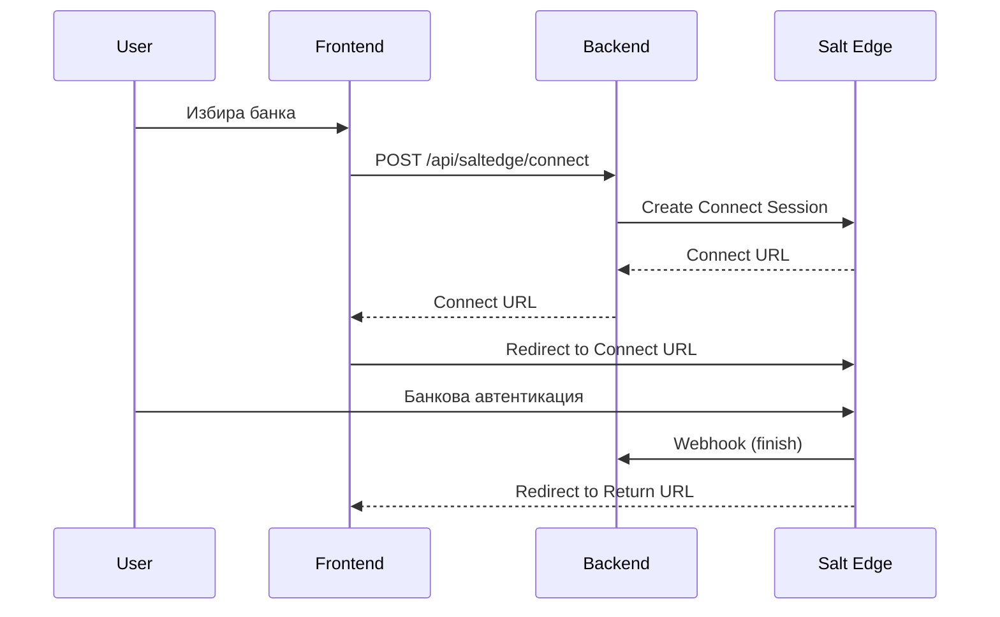
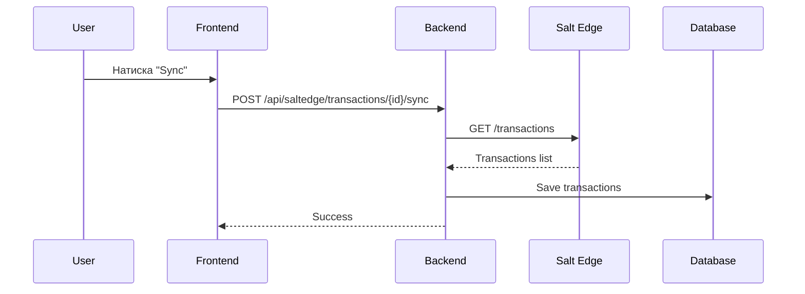

# Open Banking (Salt Edge) Интеграция

## Общ преглед

Системата поддържа два начина за импорт на банкови транзакции:
1. **Файлов импорт** - ръчно качване на файлове (MT940, CAMT.053, XML, CSV)
2. **Open Banking (Salt Edge)** - автоматично теглене на транзакции чрез PSD2 API

## Salt Edge

[Salt Edge](https://www.saltedge.com/) е платформа за Open Banking, която предоставя унифициран API за достъп до банкови сметки в цяла Европа.

### Поддържани български банки

| Банка | Provider Code | Статус |
|-------|---------------|--------|
| UniCredit Bulbank | `unicredit_bulbank_bg` | Активен |
| DSK Bank | `dsk_bank_bg` | Активен |
| Postbank | `postbank_bg` | Активен |
| Fibank | `first_investment_bank_bg` | Активен |
| UBB | `ubb_bg` | Активен |
| Raiffeisen | `raiffeisen_bank_bg` | Активен |
| OBB | `obb_bg` | Активен |
| ЦКБ | `ccb_bg` | Активен |

### Международни банки

| Банка | Provider Code |
|-------|---------------|
| Revolut | `revolut_eu` |
| Wise | `wise_eu` |
| N26 | `n26_de` |
| Paysera | `paysera_lt` |

## Конфигурация

### Per-Company API Keys

Всяка компания има собствени Salt Edge credentials, което означава:
- Всеки клиент плаща собствените си такси към Salt Edge
- Изолация на данните между компании
- Независимо управление на consent-ите

### Настройка на компания

1. Регистрирайте се в [Salt Edge](https://www.saltedge.com/)
2. Създайте Application и получете `App-id` и `Secret`
3. Отидете в **Настройки** → **Интеграции** → секция **Salt Edge Open Banking**
4. Въведете:
   - `App ID` - вашият Salt Edge App ID
   - `Secret` - вашият Salt Edge Secret (криптиран в базата данни)
   - Активирайте toggle-а `Активиране на Salt Edge`
5. Натиснете бутона **Запази Salt Edge настройките**

> **Забележка:** Secret полето не показва текущата стойност за сигурност. Оставете го празно ако не искате да го променяте.

### Database полета (companies таблица)

```sql
salt_edge_app_id VARCHAR(255)    -- Salt Edge App ID
salt_edge_secret VARCHAR(500)    -- Salt Edge Secret (криптиран)
salt_edge_enabled BOOLEAN        -- Дали е активиран
```

### GraphQL API

#### Query - четене на настройки
```graphql
query GetCompany($id: ID!) {
  company(id: $id) {
    saltEdgeAppId      # String - само App ID се връща
    saltEdgeEnabled    # Boolean!
  }
}
```

#### Mutation - запазване на настройки
```graphql
mutation UpdateCompany($id: ID!, $input: UpdateCompanyInput!) {
  updateCompany(id: $id, input: $input) {
    id
    saltEdgeEnabled
  }
}

# Input
{
  "id": "1",
  "input": {
    "saltEdgeAppId": "your-app-id",
    "saltEdgeSecret": "your-secret",  # Само при промяна
    "saltEdgeEnabled": true
  }
}
```

> **Сигурност:** `saltEdgeSecret` никога не се връща от API-то. При заявка за update, ако полето е `null` или празно, текущата стойност се запазва.

## Архитектура

### Таблици

```
salt_edge_customers      -- Salt Edge customer per company
salt_edge_connections    -- Банкови връзки
salt_edge_accounts       -- Сметки от банките
salt_edge_transactions   -- Транзакции (raw данни)
```

### Връзка между entities

```
Company (1) ──── (1) SaltEdgeCustomer
                      │
                      └── (N) SaltEdgeConnection
                               │
                               └── (N) SaltEdgeAccount ──── (1) BankProfile
                                        │
                                        └── (N) SaltEdgeTransaction
```

## API Endpoints

### Providers

```
GET /api/saltedge/providers?countryCode=BG
GET /api/saltedge/providers/bg
GET /api/saltedge/providers/{providerCode}
```

### Connection Sessions

```
POST /api/saltedge/connect?companyId={id}&providerCode={code}&returnUrl={url}
POST /api/saltedge/reconnect/{bankProfileId}?returnUrl={url}
POST /api/saltedge/refresh/{connectionId}?returnUrl={url}
```

### Connection Management

```
GET  /api/saltedge/connections/{companyId}
POST /api/saltedge/connections/{connectionId}/sync
DELETE /api/saltedge/connections/{connectionId}
```

### Account Management

```
POST /api/saltedge/accounts/{connectionId}/sync
GET  /api/saltedge/accounts/{connectionId}/unmapped
POST /api/saltedge/accounts/{saltEdgeAccountId}/link/{bankProfileId}
```

### Transaction Management

```
POST /api/saltedge/transactions/{bankProfileId}/sync?fromDate={date}&toDate={date}
GET  /api/saltedge/transactions/{bankProfileId}/unprocessed
GET  /api/saltedge/transactions/{bankProfileId}/unprocessed/count
```

### Import Processing

```
POST /api/saltedge/import/{bankProfileId}?userId={id}
```

### Webhooks

```
POST /api/saltedge/webhook
GET  /api/saltedge/callback?connection_id={id}
GET  /api/saltedge/status/{connectionId}
```

## Процес на свързване

### 1. Иницииране на връзка



### 2. Синхронизация на транзакции



## Webhook Events

Salt Edge изпраща webhooks при промени:

| Stage | Описание | Действие |
|-------|----------|----------|
| `start` | Започнато свързване | Логване |
| `connect` | Потребителят се свързва | Логване |
| `interactive` | Изисква се допълнителен вход | Логване |
| `fetch_accounts` | Извличане на сметки | `syncAccounts()` |
| `fetch_recent` | Извличане на скорошни транзакции | `syncTransactions()` |
| `fetch_full` | Пълно извличане | `syncTransactions()` |
| `finish` | Завършено | `syncConnection()` + `syncAccounts()` |
| `error` | Грешка | Записване на грешката |

## Consent Management

### Срок на consent

- Повечето банки дават consent за 90 дни
- Системата следи `consent_expires_at`
- При изтичане се изисква reconnect

### Автоматичен refresh

```sql
-- Намиране на изтичащи consent-и
SELECT * FROM salt_edge_connections
WHERE status = 'active'
AND consent_expires_at < CURRENT_TIMESTAMP + INTERVAL '7 days';
```

## Сигурност

### Криптиране на ключове

API ключовете се съхраняват в базата данни. Препоръчително е:
- Използване на database-level encryption
- Или application-level encryption (AES-256)

```java
// TODO: Implement encryption
@Column(name = "salt_edge_secret")
private String saltEdgeSecret; // Should be encrypted
```

### Webhook валидация

Salt Edge подписва webhooks с signature. Валидирайте:

```java
// Validate webhook signature
String signature = request.getHeader("Signature");
// Compare with calculated HMAC
```

## Примерен код

### Създаване на връзка

```java
// Backend
SaltEdgeConnectSession session = bankService.initiateSaltEdgeConnection(
    companyId,
    "unicredit_bulbank_bg",
    "https://app.example.com/banks/callback"
);
// Redirect user to session.getConnectUrl()
```

### Синхронизация на транзакции

```java
// Sync last month
List<SaltEdgeTransactionEntity> transactions = bankService.syncSaltEdgeTransactions(
    bankProfileId,
    LocalDate.now().minusMonths(1),
    LocalDate.now()
);
```

### Frontend интеграция

```typescript
// Initiate connection
const response = await fetch(`/api/saltedge/connect?companyId=1&providerCode=unicredit_bulbank_bg`, {
  method: 'POST'
});
const { connectUrl } = await response.json();
window.location.href = connectUrl;
```

## Troubleshooting

### Често срещани грешки

| Грешка | Причина | Решение |
|--------|---------|---------|
| `InvalidCredentialsError` | Грешни API ключове | Проверете App ID и Secret |
| `ProviderDisabledError` | Банката е временно недостъпна | Изчакайте или използвайте файлов импорт |
| `ConsentExpiredError` | Изтекъл consent | Reconnect към банката |
| `DuplicatedCustomerError` | Customer вече съществува | Използвайте съществуващия customer |

### Логове

```bash
# Backend logs
tail -f backend.log | grep -i saltedge
```

## Ценообразуване на Salt Edge

Salt Edge има различни планове:
- **Sandbox** - безплатен за тестване
- **Production** - базирано на брой connections/requests

Всяка компания плаща собствените си такси, защото използва собствени API ключове.

## Допълнителни ресурси

- [Salt Edge API Documentation](https://docs.saltedge.com/)
- [Salt Edge Dashboard](https://www.saltedge.com/dashboard)
- [PSD2 Overview](https://ec.europa.eu/info/law/payment-services-psd-2-directive-eu-2015-2366_en)
